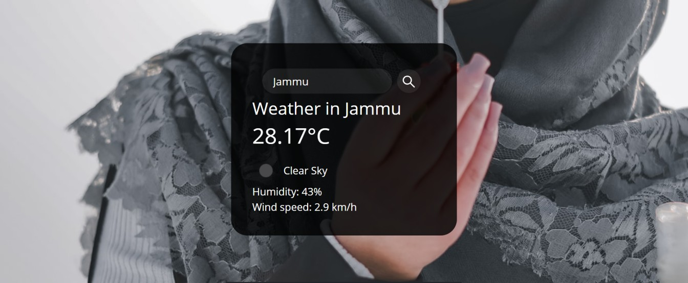

<h1>WeatherApp</h1>

<p>Simple Weather app written in HTML, CSS, and JavaScript using the APIs for fetching weather and geolocation information.</p>
# WeatherApp

Simple Weather app written in HTML, CSS, and JavaScript using APIs for fetching weather and geolocation information.

## Overview
The WeatherApp allows users to get real-time weather information based on their current location or any other specified location. The app fetches data from the Open Weather API and displays it in a user-friendly interface. Additionally, it uses the Unsplash API to fetch background images that correspond to the current weather conditions.

## Features
- **Real-Time Weather Data**: Fetches and displays current weather information.
- **Location-Based Services**: Automatically detects and uses the user's geolocation.
- **Search Functionality**: Allows users to search for weather information by city name.
- **Dynamic Backgrounds**: Changes the background image based on weather conditions.
- **Responsive Design**: Ensures the app looks good on all devices.

## Technologies Used
- **HTML5**: Structure of the app.
- **CSS3**: Styling and layout.
- **JavaScript**: Logic and API integration.

## APIs Used
- **Open Weather API**: Provides weather data including temperature, humidity, and weather conditions.
- **Unsplash API**: Supplies background images that match the current weather conditions.

## How to Use
1. **Clone the repository**:
   ```bash
   git clone https://github.com/yourusername/WeatherApp.git


<h3>Used Technologies</h3>
<ul>
  <li>HTML5</li>
  <li>CSS3</li>
  <li>JavaScript</li>
</ul>

<h3>Used APIs</h4>
<ul>
  <li>Open Weather API</li>
 <li>Unsplash API</li>
</ul>

<h3> ScreenShots </h3>  

<br>
<video controls autoplay>
  <source src="sample.mp4" type="video/mp4">
</video>
